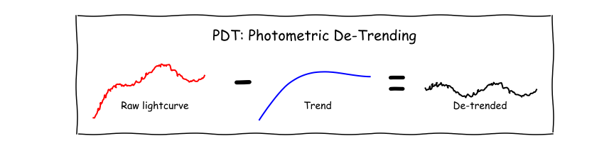
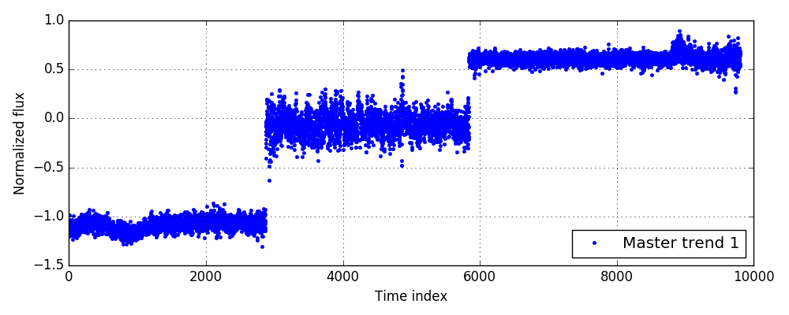
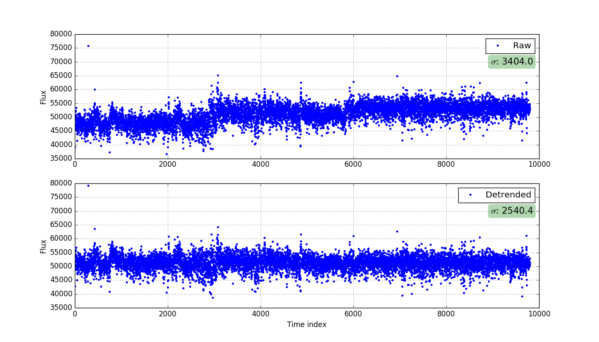
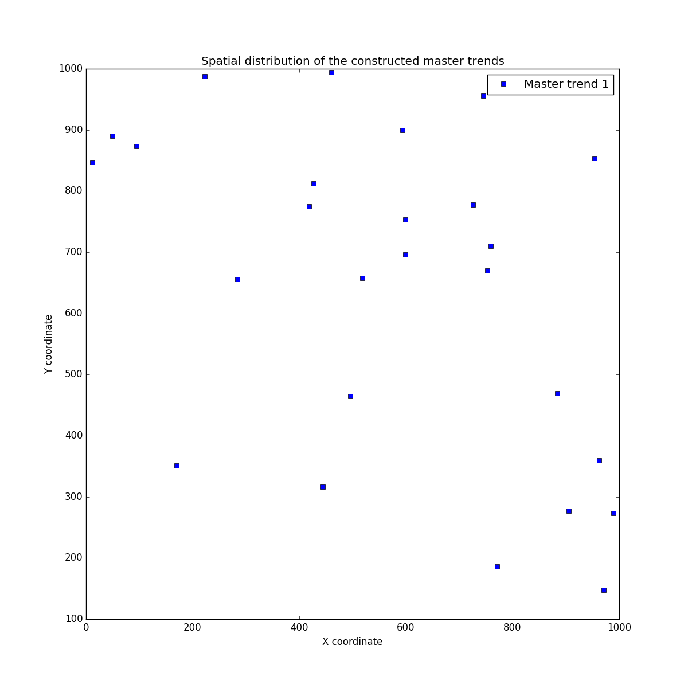

# PDT

<div align="center"></div>

PDT (<b>P</b>hotometric <b>D</b>e<b>T</b>rending Algorithm Using Machine Learning) aims to remove systematic trends in the light curves. For details about the algorithm, see [Kim et al. 2009](http://adsabs.harvard.edu/abs/2009MNRAS.397..558K). In brief, PDT finds clusters of light curves that are highly correlated using <b>machine learning</b>, construct one master trend per cluster and detrend an individual light curve using the constructed master trends by minimizing residuals while constraining coefficients to be positive.


The latest PDT uses [Birch](https://en.wikipedia.org/wiki/BIRCH) to find highly-correlated light curves rather than [Hierarchical clustering](https://en.wikipedia.org/wiki/Hierarchical_clustering) that [Kim et al. 2009](http://adsabs.harvard.edu/abs/2009MNRAS.397..558K) originally used. This is mainly because 1) Birch does not need to set the number of clusters, and 2) Birch is scalable (i.e. applicable to large dataset).


Note that PDT is designed for the light curves having the same number of data points that are <b>synced</b> in time (see [How to Use PDT](#how-to-use-pdt)). Nevertheless, PDT provides a module to deal with missing data points (i.e. not-synced data). For details, see the section: [Missing Values](#missing-values). Also note that the light curves <b>must</b> be cleaned beforehand (e.g. highly-fluctuated data points, etc).

Although PDT is designed for astronomical research, it can be applied to any kind of time series data such as stock market, weather data, etc.


## Index
1. [Dependency](#dependency)
2. [Installation](#installation)
3. [Test the Installation](#test)
4. [How to Use PDT](#how-to-use-pdt)
    * [Missing Values](#missing-values)
5. [Application](#application)

- [ChangeLog](#changelog)
- [Citation](#citation)


## Dependency

[Python 2.7+ or 3.5+](https://www.python.org/)

[Numpy 1.10+](http://www.numpy.org/)

[Scipy 0.17+](http://www.scipy.org/)
 
[Scikit-learn 0.17+](http://scikit-learn.org/)

[Matplotlib 1.5+](http://matplotlib.org/)


These libraries will be automatically installed if your machine does not have them installed. If you encounter errors during the installation of these dependencies, try to install them individually. Your machine may not have other required libraries by these dependencies.


## Installation

The easiest way to install the PDT package is:

```python
pip install pdtrend
```

Or,

```python
pip install git+https://github.com/dwkim78/pdtrend
```

If you do not want to install/upgrade the dependencies, execute the above commend with the ```--no-deps``` option. PDT possibly works with older version of Python and other libraries. 


Alternatively, you can download the PDT package from the Git repository as:

```python
git clone https://github.com/dwkim78/pdtrend

cd pdtrend
python setup.py install
```

You can edit ```setup.py```, if you do not want to update your own Python libraries (i.e. edit the ```install_requires``` variable).


## Test

To check if PDT is correctly installed, type following commands in the Python console.

```python
from pdtrend import test

test()
```

The command will print messages like:
```
yyyy-mm-dd hh:mm:ss,sss INFO - Loading the light curve set.
yyyy-mm-dd hh:mm:ss,sss INFO - 	The number of light curves is 57.
yyyy-mm-dd hh:mm:ss,sss INFO - Initializing pdtrend.
yyyy-mm-dd hh:mm:ss,sss INFO - Calculating the distance matrix.
yyyy-mm-dd hh:mm:ss,sss INFO - Searching for clusters using Birch.
yyyy-mm-dd hh:mm:ss,sss INFO - Filtering the clusters.
yyyy-mm-dd hh:mm:ss,sss INFO - Building master trends.
yyyy-mm-dd hh:mm:ss,sss INFO - Detrending one light curves using the master trends.
yyyy-mm-dd hh:mm:ss,sss INFO - Ploting results.
yyyy-mm-dd hh:mm:ss,sss INFO - Done.
```

This command reads the sample dataset consisting of 57 light curves (Python pickled and bzipped), run the clustering algorithm (i.e. Birch) to find clusters, construct master trends of those clusters, and detrend a sample light curve. It also generates three output images under the "./output" folder.

<div align="center"><br/>[ Master Trends ]</div>

The above image shows the master trend constructed by the clustering algorithm. In this example data set, PDT found one master trend. For details about what is a master trend, see [Kim et al. 2009](http://adsabs.harvard.edu/abs/2009MNRAS.397..558K). In brief, it is a representative trend of a cluster.

The following image is an example light curve before (top) and after (bottom) the detrending. Note that when PDT detrends a light curves, it minimized RMS of residuals while constraining weights for each master trend to be positive. The positive constraint is mandatory to avoid undesirable RMS minimization. For instance, if the weights are negative while the master trends are monotonically <b>increasing</b>, RMS minimization can reduce monotonically <b>decreasing</b> signals in light curves, which is unwanted. 

<div align="center">[ Example of the detrended light curve ]</div>

In addition, PDT can plot spatial distribution of the constructed master trends if x and y coordinates of stars of the light curves are given (see [How to Use PDT](#how-to-use-pdt) for details). In this test dataset, the x and y coordinates are randomly generated between 0 and 1000.

<div align="center"><br/>[ Spatial distribution of the master trend ]</div>


## How to Use PDT

Using PDT is relatively simple because PDT assumes that light curves are synced. Nevertheless, note that PDT requires enough number of light curves to find clusters and master trends. We recommend to use PDT with at least 50 light curves, but not too many such as several tens of thousands because then it might take long to run. In the latter case, we recommend to run PDT multiple times for individual subsets of the light curves.

The following pseudo code shows how to use PDT.

```python
# Import PDT.
from pdtrend import PDTrend

# Read light curves.
lcs = ...

# Create PDT instance.
pdt = PDTrend(lcs)

# Find clusters and then construct master trends.
pdt.run()

# Detrend each light curve.
for lc in lcs:
    detrended_lc = pdt.detrend(lc)
```

In order to use PDT, light curves must be read beforehand (i.e. the line  ```lcs = ...```). The ```lcs``` must consist of N rows where each row contains M columns. N is the number of light curves and M is the number of data points. ```lcs``` could be either Python list or numpy.ndarry. For example:

```python
lcs = [
        [1, 2, 3, 4, 5],
        [5, 4, 3, 2, 1],
        [3, 3, 3, 3, 3],
      ]
```

is a data set consisting of three light curves, each of which contains 5 data points.

When creating the PDT instance, you can set additional two options as:

| Option | Description |
|---:|:---|
| n_min_member | The minimum number of members in each cluster. If a cluster has fewer members, PDT discards the cluster. Default is 10. If you have a lot of light curves (e.g. several hundreds or thousands), you may want to increase this number to 20, 30, 50, 100 or so. |
| dist_cut | The distance matrix that PDT uses is (1 - correlation matrix) / 2. If a cluster found by Birch consists of light curves of random Gaussian noise (i.e. no clear variability), it is likely that the median distance between the light curves is close to 0.5. Thus we can remove clusters whose median distance is larger than 0.5. Nevertheless, the default value is set to 0.45 in order to discard less-correlated clusters as well. If you increase this value (e.g. to 0.6 or so), PDT will construct master trends consisting of non-varying light curves. |
| weights | A list of weights for the light curves. Default is None, so the identical weights for all light curves. The number of weights must be same with the number of input light curves. PDT uses the weights only when constructing master trends. See [Kim et al. 2009](http://adsabs.harvard.edu/abs/2009MNRAS.397..558K) for details. |
| xy_coords | A list of x and y spatial coordinates of a star of each light curve. Default is None. It must contains Nx2 elements, where N is the number of input light curves. The first column is the x coordinate and the second column is the y coordinate. If this list is given, you can use ```pdt.plot_spatial('/PATH/TO/FILE/ImageName.png')``` function that plots spatial distribution of the constructed master trends. |
| branching_factor | For details, see [scikit-learn Birch](http://goo.gl/HBheix). |
| threshold | For details, see [scikit-learn Birch](http://goo.gl/HBheix). |


After creating an PDT instance (e.g. ```pdt```), you can execute the command ```pdt.run()```, which will find clusters and construct master trends. To remove trends in each light curve, you can then use ```pdt.detrend(lc)``` command which will return a detrended light curve. ```lc``` is an individual light curve of either 1d list or 1d numpy.ndarray. For example, 

```python
lc = [1, 2, 3, 4, 5]
```


Note that you can apply the constructed master trends to any light curves if their data points are synced. Thus, if you preprocess your data and remove low signal-to-noise-ratio (SNR) light curves from ```lcs``` before running ```pdt.run```, you can 1) construct high SNR master trends, and 2) reduce time for calculating correlation matrix. The constructed master trends, of course, can be used to detrend the low SNR light curves.


### Accessible Information

Using the created PDT instance, you can access the following information:

| Variable | Description |
|---:|:---|
| master_trends | An array of light curves of the constructed master trends. For instance, if there are two master trends, ```master_trends``` will give something like: ```[[3, 4, 5, 1, 2], [2, 3, 5, 1, 3]]```. The first list in the array is the light curve of the first master trend, and same goes for the second list. |
| master_trends_indices | These indices correspond to the indices of ```lcs``` that are used to construct each master trend. For example, if there are two master trends, it will give something like ```[[4, 6, 8, 12, 41, 55, 68, 78, 99], [7, 11, 39, 44, 58]]```. The first list gives the indices of the light curves (i.e. indices of ```lcs```) that are used to build the first master trend, and same goes for the second list. |
| corr_matrix | A correlation matrix. The correlation coefficients are calculated using the Pearson's correlation algorithm. |
| dist_matrix | A distance matrix = (1. - the correlation matrix) / 2. Thus, between 0 and 1. 0 is the closest distance (i.e. correlation = 1) whereas 1 is the farthest distance (i.e. correlation = -1). |
| birch | A <a href="http://scikit-learn.org/">scikit-learn</a> instance of the trained Birch cluster. |

You can access these information using the PDT instance. For instance, to access ```master_trends```, you can do as follows: ```pdt.master_trends```.


### If You Get "No clusters were found" Message

It means that PDT failed to find clusters of light curves that are highly correlated. This could imply that your dataset does not have strong trends. Nevertheless, if you still want to detect clusters of (less-highly-correlated) light curves, you can either decrease ```n_min_member``` or increase ```dist_cut```, and rerun. For example,

```python
# The first execution.
pdt.run() # If this returns the message, "No clusters were found".

# Then, adjust parameters. For example:
pdt.n_min_member = 8
pdt.dist_cut = 0.6

# And then, do the second execution.
pdt.run()
```

The second execution of ```pdt.run()``` will be faster than the first execution because the Birch cluster is already trained (i.e. ```pdt.birch```) during the first execution. The Birch cluster will be retrained only if you create a new PDT instance (same goes for the correlation matrix and distance matrix).

In addition, you might want to increase ```threshold```, which is the maximum distance between sub-clusters to merge them into one cluster. Increasing the value tends to give a larger cluster (i.e. more members in the cluster), but those members might not be highly-correlated.


### Missing Values

PDT is designed to work for synced light curves in time. Nevertheless, PDT provides a module that fills missing values using interpolation. <b>Remember</b> that any kinds of these "filling missing values" methods could introduce another biases and yield undesired results. Please use this module <b>at your own risk</b>. <b>Note</b> that you must have a set of light curves that satisfies: 1) the light curves are from the same survey, 2) the sampling rate of the light curves is similar, and 3) their observation periods are generally same. If any of these condition is not satisfied, detrended results could be very inaccurate.

PDT uses interpolation of order of one (i.e. <b>linear interpolation</b>). PDT does not use higher order interpolation (e.g. quadratic or cubic) to minimize over-fitting risk. You can use the module as follows:

```python
from pdtrend import FMdata

# Filling missing data points.
fmt = FMdata(lcs_missing, times, n_min_data=3)
results = fmt.run()
```

```lcs_missing``` is an array of light curves with missing values and ```times``` is an array of observation times for the corresponding light curves. The number of data points between an individual light curve and a corresponding time list must match. The following example shows the three light curves that are not synced:

```python
lcs_missing = [
               [3, 3, 5, 4, 2],
               [5, 6, 2],
               [3, 3, 3, 3]
              ]
times = [
         [1, 2, 3, 4, 5],
         [2, 3, 4],
         [1, 3, 4, 5]
        ]
```

Note that each list in ```times``` must be in ascending order before using ```FMdata```.


The most <b>important</b> thing you have to remember is to set one parameter when creating a ```FMdata``` instance, which is:

| Variable | Description |
|---:|:---|
| n_min_data | The number of minimum data points in a light curves. If a light curve has fewer data points than this value, ```FMdata``` discards the light curve. <b>Default is 100</b>. |

Setting this parameter to a proper value is very important. For example, let's assume that observation periods of almost all light curves are about one year. If there exists one light curve whose observation period is only one month, then every light curves in the returned ```lcs``` will be one month long. Therefore, you should either increase or decrease the value of ```n_min_data``` according to the temporal characteristics of your light curves.

The returned ```results``` after executing ```fmt.run()``` is a Python dictionary containing three elements as:

| Key | Value |
|---:|:---|
| lcs | An array of light curves with the missing values filled. |
| epoch | An one-dimensional array contains <b>synced</b> observation epochs. Note that, in order to prevent extrapolation, the start epoch and the end epoch of ```epoch``` is the latest start epoch and the earliest end epoch among ```times```, respectively. Otherwise, extrapolation will occur for some light curves. |
| indices | A list of the indices for each ```lcs``` corresponding to the indices of ```lcs_missing```. Since ```FMdata``` discards light curves in ```lcs_missing``` that have fewer data points than ```n_min_data```, the returned ```lcs``` could contain the less number of light curves than ```lcs_missing```. Thus, in order to find out which light curves are not discarded, ```indices``` gives the indices of light curves in ```lcs_missing``` that are <b>not</b> discarded. This returned ```indices``` can be used to filter your own list related with ```lcs``` such as a list of weights, a list of x and y coordinates, etc. |


In case of the above example, the returned ```lcs```, ```epoch``` and ```indices``` will be (Note: of course, we cannot apply ```FMdata``` to the above example data since there are too few data points. This is just a conceptual example):

```python
results['lcs'] = [
               [3, 5, 4],
               [5, 6, 2],
               [3, 3, 3]
              ]
results['epoch'] = [2, 3, 4]
results['indices'] = [0, 1, 2]
```

The returned ```lcs``` can be ingested into PDT as: ```pdt = PDTrend(lcs); pdt.run()``` (see [How to Use PDT](#how-to-use-pdt) for details).


### Logger

If you want to write log messages either to console or to disk, you can use the PDT Logger class as:

```python
from pdtrend import Logger

logger = Logger().getLogger()

logger.debug('debug message')
logger.info('info message')
logger.warn('warn message')
logger.error('error message')
logger.critical('critical message')
```

Keep in mind that you need to generate only one logger instance through the whole processes, but not many. If you want to save log messages to a file, generate a logger instance as follows:
 
```python
logger = Logger('/PATH/TO/FILE.log').getLogger()
```

This will send log messages to both console and a log file. Note that the path must be the absolute path.


## Application

To several survey dataset.


## ChangeLog

### v.0.4.0 (planned)
- release of beta version.
    - test with HATNet, SuperWASP, and KMTNet dataset.

### v.0.3.0 (planned)
- release of alpha version.
    - add another module for dealing with missing values.

### v.0.2.3
- minor bug fixed for loading test light curves using pickle.load()
- Python 3 compatible

### v.0.2.2
- type of the output from FMdata is changed to Python dictionary.
- PEP8 style Docstring.
- many minor bugs fixed.

### v.0.2.0
- modules for dealing with missing values (i.e. not-synced observations).

### v.0.15.0
- consider weights for light curves while building master trends.
- if X and Y coordinates of light curves are given, pdtrend can plot spatial distribution of constructed master trends.
- if no master trend is found, warning and advice messages will be printed. 

### v.0.1.0
- release of pre-alpha version.
    - calculate correlation matrix and distance matrix.
    - train a Birch cluster.
    - construct master trends.
    - add a detrending module.

### v.0.0.0
- create the GitHub repository.


## Citation

If you use PDT in publication, we would appreciate citations to the paper, [Kim et al. 2009](http://adsabs.harvard.edu/abs/2009MNRAS.397..558K) and this GitHub repository as well.


## Contact
Dae-Won Kim, email: dwkim78 at gmail.com

Webpage: https://sites.google.com/site/dwkim78/


#### Keywords

astronomy - light curves - time series - trend removal - detrend - machine learning - Birch - clustering

